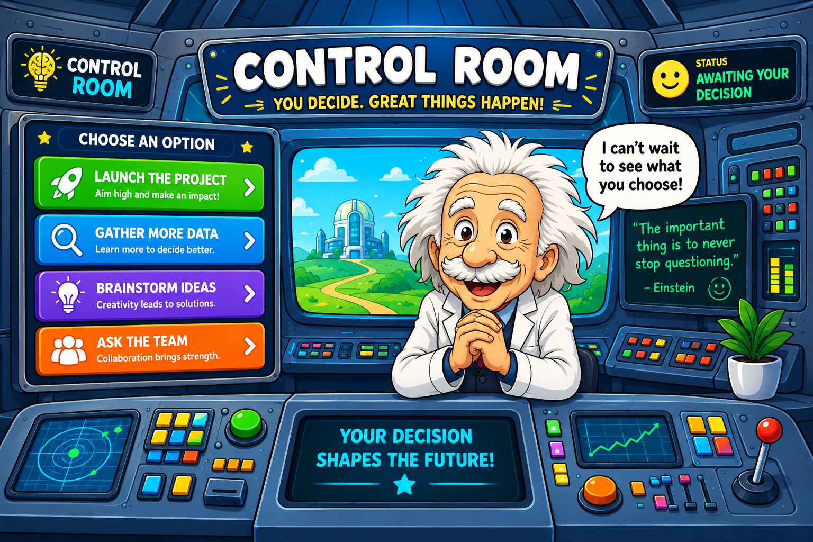
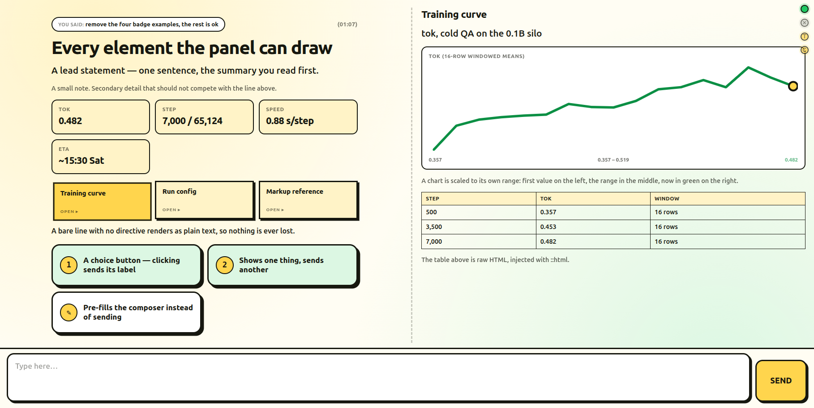

# Control Room



A big-button control panel for driving [Claude Code](https://claude.com/claude-code),
as a VS Code extension.

You type in the panel; the message is appended to `chat.jsonl`. A Claude Code session
watches that file, does the work, and answers with `reply.py` in a small line-based markup
([MARKUP.md](MARKUP.md)) that the panel renders as headlines, stat tiles, status pills,
cards and choice buttons.

```
panel  ────────►  chat.jsonl  ──►  Claude Code session
  ▲                                       │
  └──────────  reply.py  ◄────────────────┘
```

The panel needs no server and no dependencies. Answering needs Python 3 (standard library
only) on the same machine as the session.

## Every command, in one place

Four things you ever have to do. Each is one line; the rest of this file is why.

```bash
# 1. INSTALL, or update to the newest build — same command, run it again any time
gh api repos/wiiiktor/control-room/contents/extension/get.sh \
  -H 'Accept: application/vnd.github.raw' | bash

# 2. IS PYTHON THERE?  the panel does not need it; answering does
python3 -c 'import sys, fcntl, json; print("python", sys.version.split()[0], "— replies will work")'

# 3. RELOAD the running window, instead of hunting through a menu
code --open-url "vscode://wiiiktor.control-room/reload"

# 4. WHAT IS BROKEN — python, hook, room or session, named
code --open-url "vscode://wiiiktor.control-room/diagnose"
```

Give step 1 a name, so an update is one word:

```bash
echo "alias control-room-update=\"gh api repos/wiiiktor/control-room/contents/extension/get.sh -H 'Accept: application/vnd.github.raw' | bash\"" >> ~/.bashrc
# zsh (macOS default): >> ~/.zshrc instead. Then: source ~/.bashrc
```

Then **opening the two-way link**, which is the step that is not a command:

1. Open a **Claude Code tab** and send it *any* message. A session begins when it is given
   something to do, not when its tab is opened. Nothing below works before this.
2. **Ctrl+Shift+P → Control Room** and pick that session.
3. Type in the panel. The splash button turns green when the session answers.

Anything typed in the Claude tab from then on appears in the panel too, and so does its
answer — see [The panel holds both sides](#the-panel-holds-both-sides).

## Install

Needs [`gh`](https://cli.github.com), logged in (`gh auth login`). The repository is
private, so a plain URL will not do: `raw.githubusercontent.com` answers 404 for it, which
reads like a missing file rather than a missing login.

### Linux and macOS

```bash
gh api repos/wiiiktor/control-room/contents/extension/get.sh \
  -H 'Accept: application/vnd.github.raw' | bash
```

Pin a version with `| bash -s 0.12.25`. From a clone, `extension/get.sh` does the same. It
installs with whichever editor CLI the machine has — `code`, `code-insiders`, `cursor`,
`codium`, `windsurf` — or the one named in `CONTROL_ROOM_CODE`.

### Windows

⚠️ **The panel works; answering in it does not, yet.** Installing is fine and the panel
opens, renders and accepts messages — but three things in the answering half are Unix-only,
and all three were measured rather than assumed:

| | |
|---|---|
| `chatlog.py` imports `fcntl` | there is no `fcntl` on Windows Python, so `reply.py`, `status.py` and the mirror hook all die on the import |
| the hooks are registered as `python3 <script>` | Windows ships `python` and `py`, not `python3`, so the hooks never run |
| the watch is `tail -n0 -F chat.jsonl \| python3 -u watch.py` | there is no `tail` in PowerShell or `cmd` |

Under **WSL**, with the workspace opened inside it, all three are Unix again and the room
works as it does on Linux. Git Bash is not a substitute: its `python` is the Windows one,
so `fcntl` is still missing.

A fourth, cosmetic: session labels come from `~/.claude/projects/<workspace-path-with-
separators-as-dashes>`, and a Windows path starts `C:` — a colon cannot appear in a
directory name, so the encoding differs and the picker shows sessions without their names.

Installing itself: Git for Windows ships Git Bash; in it, the command above works
unchanged. Without it, in
`cmd.exe` (its redirection is byte-safe, unlike PowerShell's, which would corrupt the
archive):

```bat
gh api repos/wiiiktor/control-room/contents/extension --jq ".[].name" | findstr .vsix
cmd /c "gh api repos/wiiiktor/control-room/contents/extension/control-room-0.12.25.vsix -H "Accept: application/vnd.github.raw" > %TEMP%\cr.vsix"
code --install-extension %TEMP%\cr.vsix --force
```

No clone is needed: the .vsix carries the room's Python side (`watch.py`, `reply.py`,
`status.py`, `chatlog.py`) and writes it into `<workspace>/control-room/` the first time
the panel opens, along with the session-start hook. It never overwrites files that are
already there, so a clone's own copies win.

The installer then asks the running window to reload itself, so there is no menu step:

```bash
code --open-url "vscode://wiiiktor.control-room/reload"
```

That works from the version registering the handler onwards — the first update after this
one still needs **Ctrl+Shift+P → Developer: Reload Window**. Then **Ctrl+Shift+P → Control
Room**. The same scheme takes `/open` and `/diagnose`.

## Using it

1. Open the Claude Code tab and send it **any** message. A session starts when it is given
   something to do, not when its tab is opened — this is the step everyone misses, which is
   why the panel opens on a splash that says exactly this.
2. Open the panel: **Ctrl+Shift+P → Control Room: Open panel**. It asks which session you
   want to talk to.
3. Write. The session answers in the panel.

A workspace can hold several rooms — one folder per session, each with its own
`chat.jsonl` — and every `control-room*` folder is offered as a separate panel.

## What runs where

| File | What it does | Needs |
|---|---|---|
| `extension/` | the panel: reads and writes `chat.jsonl` itself | VS Code 1.84+ |
| `watch.py` | prints each new message for the session to answer, and announces anything unanswered when it starts | Python 3 |
| `reply.py` | posts an assistant reply into the log | Python 3 |
| `status.py` | progress lines shown while a reply is being worked on | Python 3 |
| `chatlog.py` | the log format, shared by the three above | Python 3 |

Nothing here is Linux-specific: the paths come from the workspace, the timestamps are
local, and `fcntl` locking works on macOS. What is *not* portable is the conversation —
`chat.jsonl` is per machine and deliberately not in the repository, so a fresh clone gives
you the extension and an empty room.

### Checking Python

The extension host reads and writes the log itself, so the panel opens, renders and accepts
messages on a machine with no Python at all. What needs it is the *answering* half. Missing,
it looks exactly like a broken bridge: the panel takes your message and nothing ever comes
back.

```bash
python3 -c 'import sys, fcntl, json; print("python", sys.version.split()[0], "— replies will work")'
```

The imports are the point — `fcntl` is what serialises two writers into one log, and it does
not exist on Windows Python. That is why the answering half needs WSL there; see
[Windows](#windows). Any Python 3.8 or newer will do; there are no third-party packages to
install, now or ever.

If the command prints nothing:

| | |
|---|---|
| macOS | `brew install python3` (or Xcode command line tools) |
| Debian / Ubuntu | `sudo apt install python3` |
| Fedora | `sudo dnf install python3` |

The installer runs this check for you and says which of the two answers it got. So does
**Control Room: Diagnose the bridge**.

## The panel holds both sides

What you type in the Claude tab never reaches the panel, and what Claude answers there
only arrives if it was sent with `reply.py` — so the panel shows half a conversation. The
extension installs two more hooks, `UserPromptSubmit` and `Stop`, that copy both sides in.

Mirrored lines are marked `mirror` in the log and `watch.py` ignores them: they are a
record, not a request, so nothing is answered twice and no answer is mirrored back in
turn. A `Stop` that follows a `reply.py` answer within two minutes adds nothing, since
that answer is already in the panel, in markup. Turn it off with
`controlRoom.mirrorEditorChat`.

Three kinds of line never cross:

- **What the harness typed.** Claude Code submits its own turns through the same hook — a
  background task finishing, a system reminder, the output of a slash command. Those are
  not mirrored, and the wrappers it puts around what *you* paste are stripped so the panel
  shows your words rather than the tags around them.
- **The answer to one of those.** A turn that exists only because a monitor expired has no
  question in the panel for its reply to sit under, so the reply stays out too. Without
  this the log filled with "re-armed, quiet" against nothing.
- **A reply already sent with `reply.py`.** It is in the panel in markup; the plain-text
  copy would be the same thing twice.

The instructions the extension gives each session say the same thing in the other
direction — re-arming the watch is housekeeping, and housekeeping is not reported.

## Taking a reply out of the strip

Hovering a thumbnail in the timeline shows a small **×**. It removes that reply from the
strip — and *only* from the strip. The id goes into `<room>/.hidden`, one per line, and the
message stays in `chat.jsonl` untouched.

That indirection is deliberate. Editing the log is the obvious way to delete something and
it is the one thing this project has already been burned by: `tail -F` re-reads a file from
the top when it is truncated, so rewriting `chat.jsonl` replays every message into whatever
watch is running — eleven old questions arriving as new, one of them a `delete` command. The
log is append-only. To bring a thumbnail back, delete its line from `.hidden`.

## When the bridge does not work

**Ctrl+Shift+P → Control Room: Diagnose the bridge** opens a report naming which of the
four possible faults it is: no room, no Python, no hook, or no session. It also prints the
last few messages in the room, which is how you tell whether the panel is writing where the
watch is reading.

## Keeping the panel alive

What reads the log is a watch running **inside** a Claude Code session, so it dies with
that session — and nothing else can start it again. Until it is back, messages you type sit
in `chat.jsonl` unread, which looks exactly like the panel being broken. The panel says so:
the corner pill goes **NOT WATCHING** and the tab title gains `(no watcher)`.

The extension installs a `SessionStart` hook that closes most of this gap, the first time
a panel opens — no prompt, because it is machinery you have not met yet. It writes
`.claude/hooks/control-room-watch.py` and merges one entry into `.claude/settings.json`, so
every Claude session in the workspace is told at startup to arm the watch — on the room
*that* session belongs to — and how many messages are waiting. To redo it by hand, run **Control Room: Install the session-start watch hook**. Existing
settings are preserved and installing twice is a no-op.

## Permissions: letting Claude work without a prompt per action

The VS Code extension does **not** read `permissions.defaultMode` from
`~/.claude/settings.json`. It reads two of its own VS Code settings, and falls back to
prompting — silently — if only one of them is set:

```json
{
  "claudeCode.allowDangerouslySkipPermissions": true,
  "claudeCode.initialPermissionMode": "bypassPermissions"
}
```

The first is a gate, the second sets the starting mode; with only the second,
`getInitialPermissionMode()` returns `"default"` and nothing appears to happen.

Put them in your user settings file — *Preferences: Open User Settings (JSON)* opens the
right one on any platform, or edit it directly:

| | |
|---|---|
| Linux | `~/.config/Code/User/settings.json` |
| macOS | `~/Library/Application Support/Code/User/settings.json` |
| Windows | `%APPDATA%\Code\User\settings.json` |

...or let Claude do it — this prompt is also in the panel's splash, under *Info on how to
set required Permission Mode*:

> Set the two VS Code settings that let the Claude Code extension act without asking
> permission for every step: `claudeCode.allowDangerouslySkipPermissions = true` and
> `claudeCode.initialPermissionMode = "bypassPermissions"`. Put both in my VS Code user
> settings.json, keeping everything else in the file, then tell me to reload the window.

Reload the window afterwards. The confirmation is the words **bypass permissions** under
the Claude input box. As the name says, this skips the per-action confirmations — turn it
on for a workspace you trust, not by reflex.

## Installing an update restarts the extension host

VS Code reloads every extension when one is installed, and Claude Code is one of them: its
tab says *"Claude Code stopped responding in this tab…"* and its session connection drops.
That is the install working. The Control Room panel comes back on its own — it registers a
webview serializer and each panel records which room it belongs to — but the Claude tab
needs reopening from the session list, and the watch needs one message to start again.

## The markup

[MARKUP.md](MARKUP.md) is the whole language: `::ask ::say ::note ::kv ::ok ::warn ::err
::wait ::pick ::fill ::chart ::html ::card`. Replies also take `**bold**`, `` `code` `` and
`*italic*` inline.


